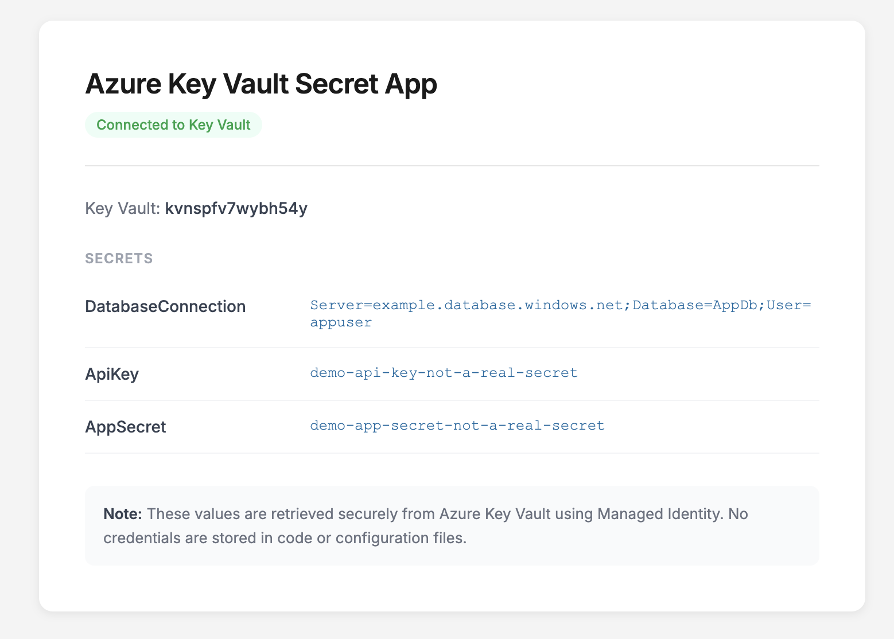

# Azure Key Vault + Managed Identity Demo

A proof-of-concept that deploys an ASP.NET Core 9 web app on Azure App Service which reads its secrets from Azure Key Vault using a **System-Assigned Managed Identity**. No credentials are stored in code, config, or environment variables — the app authenticates to Key Vault using only its identity.

> **Important — this is a proof of concept.**
> The deployed page prints secret values directly to the browser. That is intentional for this demo: it visually confirms that the app retrieved the secrets through Managed Identity rather than from local config. **Never do this in a real application.** Secrets should be consumed inside the app (e.g. used to open a database connection) and never rendered to the UI, written to logs, or returned in HTTP responses.



## What this is for

The pattern this repo demonstrates — secrets in Key Vault, accessed from a Web App via Managed Identity, with RBAC controlling who can read what — is the standard way to handle credentials in modern Azure workloads. It removes connection strings and API keys from `appsettings.json`, environment variables, and CI/CD secrets.

I built it because the publicly available walkthroughs for this pattern were out of date: older .NET runtimes, access-policy-based authorization instead of the RBAC model Microsoft now recommends, missing role-propagation waits, and no working end-to-end script. The full flow is captured here as a Bicep template plus a small wrapper script.

> The repo is `azure-key-vault-secret-app` (the deployable thing); the title above describes the concept it demonstrates.

## What I learned building this

A few things that turned out to be more involved than the tutorials suggested:

- **Role assignments are eventually consistent.** When you enable a system-assigned managed identity on an App Service, the corresponding service principal in Entra ID can take 30–60 seconds to become visible to RBAC operations. Bicep avoids this problem because ARM sequences the identity creation and the role assignment in a single deployment graph.
- **RBAC vs access policies.** Key Vault has two authorization modes. Access policies are the older, vault-local model; RBAC uses Azure-wide role assignments and is the current recommendation. This demo uses RBAC throughout (`Key Vault Secrets Officer` for the deploying user, `Key Vault Secrets User` for the Web App).
- **`DefaultAzureCredential` is doing more than it looks.** It transparently tries multiple credential sources — environment variables, managed identity, Azure CLI login, Visual Studio — so the same `Program.cs` would work locally against `az login` and in production against the managed identity, with no code change.
- **Key Vault as a configuration provider.** Once registered with `builder.Configuration.AddAzureKeyVault(...)`, secrets are accessed through the standard `IConfiguration` API. The application code doesn't know or care that the value came from Key Vault rather than `appsettings.json` — which means swapping in Key Vault is a deployment concern, not a code change.
- **How this differs from the MS Learn walkthrough.** The official tutorial ([*Create and retrieve secrets from Azure Key Vault*](https://microsoftlearning.github.io/mslearn-azure-developer/instructions/azure-secure-solutions/01-key-vault-store-retrieve.html)) is a local console app running in Cloud Shell, authenticating as your own user via `az login`. It demonstrates the SDK calls (`SetSecretAsync` / `GetSecretAsync`) but doesn't cover deployment, managed identity, or RBAC for the application principal. This repo fills that gap: it stands the whole pattern up as it would actually run in production.

## Architecture

```
Browser
  │
  ▼
App Service (ASP.NET Core 9)
  │  uses System-Assigned Managed Identity
  ▼
Azure Key Vault (RBAC)
  ├── DatabaseConnection
  ├── ApiKey
  └── AppSecret
```

The Web App is configured with a single environment variable, `KeyVaultName`. On startup the app constructs a `DefaultAzureCredential` and registers Key Vault as a configuration provider, so secrets are then accessed through the standard `IConfiguration` interface — exactly the same code you'd write against `appsettings.json`.

The infrastructure lives in [`bicep/`](./bicep/): `main.bicep` is the template, `main.bicepparam` holds the parameter values, and `deploy.sh` is a thin wrapper that runs `az deployment group create` and publishes the app code.

## Requirements

- An Azure subscription where you can create resource groups, role assignments, and App Services
- Azure CLI (`az`) — log in once with `az login`
- .NET 9 SDK
- `zip` and `jq`

Tested on macOS and Linux. On Windows, run from WSL — the deploy script is bash and relies on POSIX tools.

## Deploy from GitHub

The repo lives at [github.com/Transpolar/azure-key-vault-secret-app](https://github.com/Transpolar/azure-key-vault-secret-app).

```bash
git clone https://github.com/Transpolar/azure-key-vault-secret-app.git
cd azure-key-vault-secret-app/bicep
chmod +x deploy.sh
./deploy.sh
```

The script prints an App URL when it finishes. Give the App Service ~60 seconds to cold-start, then open the URL.

If a previous deploy failed midway, the Key Vault may still be soft-deleted under the same name and the redeploy will fail with `ConflictError: vault with the same name already exists in deleted state`. Purge it first:

```bash
az keyvault purge --name <name-from-error> --location norwayeast
```

## Cleanup

```bash
az group delete --name keyvault-secret-app-rg --yes --no-wait
```

This removes the resource group and everything inside it. The Key Vault is soft-delete-enabled by default, so its name remains reserved for 90 days — if you want to redeploy with the same name within that window, run `az keyvault purge --name <name>`.

## Notes

- The secret values committed in this repo are demo placeholders, not real credentials. For a real deployment, pass secrets at deploy time (e.g. `--parameters apiKey=$(read -s)`) rather than committing them, and consider sourcing them from a separate Key Vault that holds bootstrap secrets.
- The default region is `norwayeast`. Change `LOCATION` at the top of `deploy.sh` (or the `location` parameter in `main.bicepparam`) if you want a different region.
- The Web App SKU is `B1` (Basic) — cheap to run but slow to cold-start. Change `appServicePlanSku` in `main.bicep` if you want something faster.
